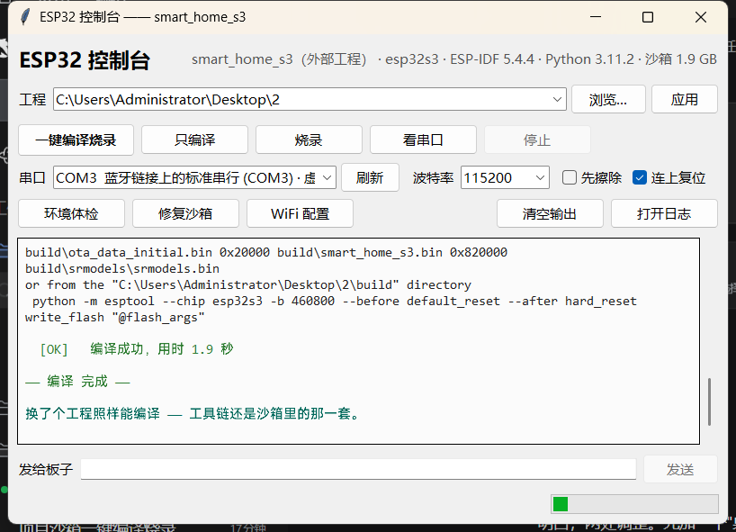

# ESP32-S3 智能家居

语音、手机和自动控制全屋灯、窗帘、风扇，还能看温湿度

> ## 只想编译烧录？两步
>
> 1. 改代码（要连 WiFi 就改 [`components/App/wifi_config.h`](components/App/wifi_config.h) 那两行）
> 2. 按**你自己的系统**敲一条命令：
>
> ```bat
> :: Windows —— 或者直接双击 .idf-sandbox\启动-Windows.cmd
> python .idf-sandbox\start.py
> ```
>
> ```bash
> # Linux —— 或者 sh .idf-sandbox/start-linux.sh
> python3 .idf-sandbox/start.py
> ```
>
> 弹出一个小窗口，按钮点「一键编译烧录」就行：自动编译 → 烧录 → 打开串口，
> 输出实时显示在窗口里，底下还能直接给板子发命令。
>
> 📖 **分不清哪个文件干什么？看 [`docs/使用说明.md`](docs/使用说明.md)** ——
> 一页纸讲清"哪些文件要碰、哪些别动、交付要拷什么"。
>
> 
>
> **Windows 和 Linux 两套工具链装在同一个 `.idf-sandbox/` 里**（各占各的目录），
> 用哪套由当前系统自动决定；两边都装了的话第一次会问一句。
> 这台电脑什么都不用装 —— 不用 C 编译器、不用 CMake、不用 Ninja、不用 Python、
> 不用 ESP-IDF。细节见下面的[「如何编译」](#如何编译windowslinux双击就行什么都不用装)。

```text
esp32_smart_home/                    ← 主项目文件夹：只有 ESP-IDF 工程自己的东西
│
├── CMakeLists.txt                 顶层构建脚本
├── partitions-16MiB.csv           Flash 分区表
├── sdkconfig                      当前生效的配置
├── sdkconfig.defaults             默认配置
├── dependencies.lock              依赖版本锁定
├── .gitattributes                 脚本强制 LF 换行
│
├── main/                          程序入口
│   ├── main.c                     开机启动、建任务、串口调试台
│   ├── astra_glue.cpp             界面和业务的连接层
│   ├── astra_glue.h
│   ├── Kconfig.projbuild          全部可配置项
│   ├── idf_component.yml
│   └── CMakeLists.txt
│
├── components/                    功能组件
│   │
│   ├── BSP/                       硬件驱动
│   │   ├── board_config.h         全部引脚定义
│   │   ├── board.c / board.h      逐个初始化各器件
│   │   ├── CMakeLists.txt
│   │   ├── I2C/       i2c_bus.c/.h
│   │   ├── ADC/       adc_bus.c/.h
│   │   ├── WS2812/    ws2812.c/.h
│   │   ├── LED/       led.c/.h
│   │   ├── SERVO/     servo.c/.h
│   │   ├── FAN/       fan.c/.h
│   │   ├── SENSOR/    sensor.c/.h
│   │   ├── OLED/      oled.c/.h
│   │   ├── KEY/       key.c/.h
│   │   ├── ADKEY/     adkey.c/.h + adkey_logic.h
│   │   ├── I2S_MIC/   i2s_mic.c/.h
│   │   └── VOICE/     voice.c/.h + voice_internal.h + voice_esp_sr.c/.h
│   │
│   ├── App/                       设备逻辑
│   │   ├── device_model.c/.h      所有设备的统一状态
│   │   ├── automation.c/.h        自动联动规则和阈值
│   │   ├── app_link.c/.h          消息上行通道
│   │   ├── app_cmd.h
│   │   ├── wifi_sta.c/.h          WiFi 连接
│   │   ├── wifi_config.h          WiFi 账号配置（改这两行，见下文）
│   │   ├── mqtt_app.c/.h          MQTT 联网控制
│   │   ├── mqtt_protocol.c/.h     话题和消息格式
│   │   ├── ble_app.c/.h           蓝牙控制
│   │   ├── selftest.c/.h          键盘自检
│   │   └── CMakeLists.txt
│   │
│   ├── astra_ui/                  屏幕界面框架
│   │   ├── astra/astra_rocket.cpp/.h
│   │   ├── astra/config/config.h  排版参数
│   │   ├── astra/ui/launcher.cpp/.h
│   │   ├── astra/ui/element/page/item.cpp/.h
│   │   ├── hal/hal.cpp/.h
│   │   ├── hal/esp32/astra_hal_esp32.cpp/.h
│   │   └── CMakeLists.txt
│   │
│   └── u8g2/                      第三方图形库
│       ├── csrc/                  显示驱动和字库
│       └── CMakeLists.txt
│
├── android/                       手机 App
│   ├── app/src/main/
│   │   ├── AndroidManifest.xml
│   │   ├── java/com/smarthome/ble/
│   │   │   ├── MainActivity.kt
│   │   │   ├── SmartHomeViewModel.kt
│   │   │   ├── ble/BleManager.kt
│   │   │   ├── data/Contract.kt
│   │   │   ├── data/Json.kt
│   │   │   ├── data/Models.kt
│   │   │   └── ui/theme/Theme.kt
│   │   └── res/                   图标和主题
│   ├── app/build.gradle.kts
│   ├── app/proguard-rules.pro
│   ├── build.gradle.kts
│   ├── settings.gradle.kts
│   ├── gradle.properties
│   ├── gradle/wrapper/
│   ├── gradlew / gradlew.bat
│   ├── local.properties
│   ├── build.ps1                  构建脚本（Windows）
│   ├── build.sh                   构建脚本（Linux）
│   ├── apk/                       装好的安装包
│   └── README.md
│
├── docs/                          说明文档
│   ├── 接线文档.md                需求、架构、引脚、接线、协议、排错汇总
│   └── 控制台界面.png             图形控制台截图
│
├── 3D_file/                       3D 模型（外壳底座）
│   ├── 外壳底座.SLDPRT            SolidWorks 建模源文件
│   └── STL/外壳底座.STL           导出给 3D 打印的 STL
│
├── tools/                         老脚本（上一个方案留下的，可以完全不看）
│   │
│   ├── _common.sh                 公共函数（各脚本共用）
│   │
│   ├── build/                     编译与烧录
│   │   ├── build.sh               编译（Linux）
│   │   ├── flash.sh               擦除并烧录（Linux）
│   │   ├── setup.sh               环境检查（Linux）
│   │   ├── build.ps1              编译（Windows，已有系统 ESP-IDF 时用）
│   │   ├── flash.ps1              擦除并烧录（Windows）
│   │   ├── run_idf.ps1            备用编译入口（Windows）
│   │   └── idf_pio.ps1            同上，实际实现
│   │
│   ├── monitor/                   看串口 / 抓包
│   │   ├── monitor.sh             串口监视（Linux）
│   │   ├── monitor.ps1            串口监视（Windows，已被 sandbox/monitor.py 取代）
│   │   ├── monitor.cmd            同上，双击即可运行
│   │   ├── ble_probe.py           蓝牙探针
│   │   └── voice_debug.py         语音链路调试
│   │
│   ├── verify/                    验证与自检
│   │   ├── check_comments.sh      注释自检（Linux）
│   │   ├── check_comments.ps1     注释自检（Windows）
│   │   ├── verify_adkey.ps1       键盘实测（Windows）
│   │   ├── run_adkey_test.ps1     判键逻辑单测（Windows）
│   │   ├── adkey_test.c           同上，测试源码
│   │   ├── run_ui_preview.ps1     排版预览（Windows）
│   │   └── ui_layout_preview.cpp  同上，预览源码
│   │
│   └── dev/                       开发辅助（预留）
│
├── .idf-sandbox/                  ★ 沙箱：环境 + 脚本 + 入口，全在这儿
│   │                                （Windows 和 Linux 两套并排放）
│   ├── start.py                    ★ 总入口：认系统 → 选工具链 → 干活
│   ├── 启动-Windows.cmd             Windows 上双击这个（不用敲命令）
│   ├── start-linux.sh              Linux 上跑这个：sh .idf-sandbox/start-linux.sh
│   ├── 一键编译烧录.py              双击版 → start.py run
│   ├── 只编译.py                    双击版 → start.py build
│   ├── 只看串口.py                  双击版 → start.py monitor
│   ├── 环境体检.py                  双击版 → start.py doctor
│   ├── 修复沙箱.py                  双击版 → start.py prepare
│   │
│   ├── tools/                      入口背后真正干活的地方（一般不用看）
│   │   ├── core.py                 沙箱定位 + 平台判定 + 环境变量
│   │   ├── gui.py                  图形控制台（tkinter，不用装任何库）
│   │   ├── run.py                  一键：编译 + 烧录 + 串口监视器
│   │   ├── build.py                编译
│   │   ├── flash.py                烧录
│   │   ├── monitor.py              串口监视器（带 Tab 补全、彩色日志）
│   │   ├── doctor.py               环境体检
│   │   └── prepare.py              沙箱准备 / 修复
│   │
│   ├── idf/                        ESP-IDF 5.4.4（两个平台共用）
│   │
│   ├── python/                     ┐ Windows 的 Python（含 Tcl/Tk 和依赖）
│   ├── penv/                       │ 虚拟环境
│   ├── idf_tools/                  │ xtensa gcc / cmake / ninja（*.exe）
│   ├── drivers/                    ┘ USB 转串口驱动（只有 Windows 要装）
│   │
│   ├── python-linux/               ┐ Linux 的 Python
│   ├── penv-linux/                 │ 虚拟环境
│   ├── idf_tools-linux/            ┘ xtensa gcc / cmake / ninja（ELF）
│   │
│   ├── logs/                       运行日志（编译 / 烧录 / 串口 / 体检）
│   ├── tmp/                        编译临时目录
│   ├── sandbox.json                版本清单
│   └── README.md                   沙箱说明
│
├── managed_components/            组件管理器下载的依赖（esp-sr 等）
├── .vscode/settings.json
└── .gitignore
```

> 上表里的 `a.c/.h` 表示同名的一对源文件和头文件
> 下面的目录没有列进来：编译生成的 `build/`、以及 `.git`
>
> **沙箱是自包含的**：`.idf-sandbox/` 一个文件夹里啥都有（环境 + 脚本 + 入口），
> 拷到任何一个 ESP-IDF 工程旁边都能直接用，主项目文件夹里不留东西。

## 如何配置 WiFi

WiFi 账号写在**一个文件**里，改两行就行，不用动代码

```text
components/App/wifi_config.h
```

```c
#define APP_WIFI_SSID       "YOUR_WIFI_SSID"     // 改成你家的 WiFi 名（必须 2.4GHz）
#define APP_WIFI_PASSWORD   "YOUR_WIFI_PASSWORD" // 改成 WiFi 密码；开放网络写 ""
```

改完重新编译烧录：

```text
双击 工程根目录的  一键编译烧录.py        # Windows，推荐
tools/build/build.sh                     # Linux
```

要点：

- 没填也能编译能跑：串口启动时会打印
  `WiFi 还没配置：请编辑 components/App/wifi_config.h 填上 SSID 与密码`
- 连不上先查三点：**必须是 2.4GHz**（ESP32-S3 不支持 5GHz）、SSID 里没有多余空格、密码正确
- WiFi 重连次数仍在 `idf.py menuconfig → 智能家居 —— 项目配置 → WiFi 设置`；
  读取逻辑与注释在 [`components/App/wifi_sta.c`](components/App/wifi_sta.c) 开头


## 如何编译（Windows/Linux：敲一条命令，什么都不用装）

工程里自带了**一整套编译环境**，装在 `.idf-sandbox/` 里。

**Windows 和 Linux 两套工具链装在同一个沙箱里** —— 它们各占各的目录，
互不干扰，用哪套由当前系统自动决定：

| | Windows | Linux |
|---|---|---|
| 入口（双击/执行） | `.idf-sandbox\启动-Windows.cmd` | `sh .idf-sandbox/start-linux.sh` |
| 入口（命令行） | `python .idf-sandbox\start.py` | `python3 .idf-sandbox/start.py` |
| 便携 Python | `python/` | `python-linux/` |
| 虚拟环境 | `penv/` | `penv-linux/` |
| 工具链 | `idf_tools/`（`*.exe`） | `idf_tools-linux/`（ELF） |
| 串口驱动 | 需要（打包在 `drivers/`） | 不需要，内核自带 |

**两边共用**的是 ESP-IDF 源码 `idf/`（纯 Python + C，跟平台无关）。

> 工具链是可执行文件，Windows 的是 PE、Linux 的是 ELF，**不能互相运行**。
> 所以沙箱里是"两套并排"，不是"一套通用"。
> 想显式指定用哪套：`--os windows` / `--os linux`（默认 `--os auto`）。
> 如果两套都装了，第一次运行会**问你要用哪一套**，问过就记住了。

客户电脑上**不需要装**：C 编译器、CMake、Ninja、ESP-IDF —— 一个都不用。
Linux 上只需要系统自带的 `python3`（一般都有）。

### 环境怎么来：两种方式

**方式 A：拷文件夹（离线，推荐给客户）**

把整个工程文件夹拷过去，`.idf-sandbox/` 里环境都是现成的，插上就能用，全程不联网。

**方式 B：在线配置（手头只有源码时用）**

从 GitHub 上 clone 下来只有源码和脚本（**没有环境**）。这时候打开图形控制台，
点一下 **「配置沙箱环境」**：

```
┌──────────────────────────────────────────────────────┐
│ 工程  [esp32_smart_home            ▾] [浏览…] [应用]  │
│ [一键编译烧录] [只编译] [烧录] [看串口] [停止]        │
│ 串口  [COM31 ▾] [刷新]  波特率 [115200 ▾] □先擦除     │
│ [配置沙箱环境] [环境体检] [修复沙箱] [清理空间] [WiFi 配置] │
└──────────────────────────────────────────────────────┘
```

它会自己从官方源把缺的东西下齐（走 Espressif 国内镜像，实测 2~5 MB/s）：

**从 GitHub clone 下来是什么都没有的**（只有脚本），所以「配置沙箱环境」会按这个顺序补齐：

| 下载什么 | 从哪下 | 多大 |
|---|---|---|
| **便携 Python 3.11.17**（自带 tkinter） | `registry.npmmirror.com` | 46 MB |
| ESP-IDF 5.4.4 源码 | `dl.espressif.com` | 1.9 GB（解压后只留 357 MB） |
| xtensa 交叉编译器 | `dl.espressif.com` | 约 250 MB |
| CMake / Ninja / ROM 链接脚本 | `dl.espressif.com` | 约 55 MB |
| ESP-IDF 的 Python 依赖 | PyPI（慢就自动换清华镜像） | 约 60 MB |
| esp-sr 语音组件 | `components.espressif.com` | 约 230 MB |

**全部落在 `.idf-sandbox/` 里面** —— 不装 C 编译器、不改 PATH、不写注册表、
不装全局 Python 包。卸载就是把文件夹删掉，一个字节都不留在系统里。

> **想知道它到底行不行？** 实测过：把环境删干净只留 42.6 MB 脚本，
> 从头跑一遍 —— 4 步全过、自检全绿、编译 123.4 秒，
> 出来的 `esp32_smart_home.bin` 和完整工程编的**逐字节一致**（`0x1dcc80`）。

命令行等价操作：

```bat
python .idf-sandbox\start.py prepare --download     :: Windows
```
```bash
python3 .idf-sandbox/start.py prepare --download    # Linux
```

配套命令（一般用图形界面上的按钮就行）：

```bat
python .idf-sandbox\start.py prepare --check          :: 自检：每项都真跑一遍
python .idf-sandbox\start.py prepare --prune          :: 看能清理多少（不删）
python .idf-sandbox\start.py prepare --prune --yes    :: 真删，腾硬盘（约 1.7 GB）
python .idf-sandbox\start.py prepare --fetch linux    :: 在 Windows 上给 Linux 备好工具链
```

**要拷到 Linux 机器上？** Linux 那套工具链默认不装（省 1.4 GB）。
先跑一次 `prepare --fetch linux` 备好再拷（约 3 分钟）；
那台机器能上网的话，也可以到了那边直接点「配置沙箱环境」。

**下完会自己检查**，每一项都真的跑一遍（不是只看文件在不在）：

```
--- 自检 ------------------------------------------------------
  [OK]   ESP-IDF 源码        5.4.4
  [OK]   Python 环境         3.14.0
  [OK]   交叉编译器          xtensa-esp-elf-gcc-14.2.0 ...
  [OK]   idf.py 端到端       ESP-IDF v5.4.4
  [OK]   组件依赖            232.7 MB
  [OK]   自检全部通过 —— 可以点"一键编译烧录"了
```

想单独体检也可以：`python .idf-sandbox\start.py prepare --check`。

中途断网/关掉不要紧，**再点一次会接着下**（已经下好的跳过，压缩包下完就删）。

### 方式一：图形控制台（推荐）

**`start.py` 是整个沙箱的总入口**，所有启动逻辑都写在它里面（自带，不依赖任何东西）：

```bat
:: Windows
python .idf-sandbox\start.py
```

```bash
# Linux
python3 .idf-sandbox/start.py
```

Windows 上也可以直接双击 `.idf-sandbox\启动-Windows.cmd`。窗口长这样：


**顶上的「工程」那一行是"要编译哪个工程"**，可以随时换：

| 按钮 | 干什么 |
|---|---|
| 工程输入框 | 填任意 ESP-IDF 工程的目录；下拉里是最近用过的几个 |
| 浏览… | 弹文件夹选择框，**默认从桌面开始**（工程一般都放桌面上） |
| 应用 | 让输入框里的路径生效（也可以直接回车） |

第一次打开时，输入框里是**这个工程**（沙箱自带的那个）；之后会记住你上次选的，
下次打开接着用。想切回来，用「浏览…」选一下就行。

换工程不影响工具链：**编译器、Python、ESP-IDF 始终用沙箱里的那一套**，
只有源码、`sdkconfig`、`build/`、`managed_components/` 来自被选的工程。
所以沙箱放哪儿都行，可以拿它编桌面上任何一个 ESP-IDF 工程。

| 按钮 | 干什么 |
|---|---|
| **一键编译烧录** | 编译 → 烧录 → 连上串口，一条龙。日常就用这个 |
| 只编译 | 只检查代码能不能编过，板子没插也行 |
| 烧录 | 只烧录（用上次编译好的固件） |
| 看串口 | 只连串口，输出实时显示在窗口里 |
| 停止 | 中断正在跑的编译/烧录，或者断开串口 |
| 环境体检 / 修复沙箱 | 出问题时用，跟下面的命令行版本等价 |
| WiFi 配置 | 直接用记事本打开 `components/App/wifi_config.h` |

窗口里还有：

- **串口下拉框**：自动列出所有 COM 口并标出芯片型号，虚拟串口（蓝牙之类）排在最后
- **底部输入框**：串口连着的时候，敲命令回车就发给板子（跟命令行监视器一样）
- **彩色日志**：错误红、警告黄、`[OK]` 绿，编译和体检的输出都实时刷新
- **打开日志**：一键跳到 `logs\` 目录

窗口是用 Python 自带的 tkinter 写的，**不用 pip 装任何东西**。
上次用的工程、串口、波特率都会记住，下次打开接着用。

### 方式二：命令行（开发机上更顺手）

改完代码 → 在命令行敲 **`python .idf-sandbox\start.py`**（或者双击 `start.py`）。

窗口里点按钮也行；不想开窗口就用命令行，**一个 `start.py` 管全部**：

```bat
python .idf-sandbox\start.py              图形控制台（默认，等于双击 start.py）
python .idf-sandbox\start.py build        只编译，板子没插也能跑
python .idf-sandbox\start.py flash        只烧录
python .idf-sandbox\start.py monitor      只看串口
python .idf-sandbox\start.py run          编译 + 烧录 + 看串口，一条龙
python .idf-sandbox\start.py doctor       环境体检
python .idf-sandbox\start.py prepare      修复沙箱
python .idf-sandbox\start.py --help       看全部
```

参数照常接在后面：

```bat
python .idf-sandbox\start.py build --clean
python .idf-sandbox\start.py run -p COM31 --erase
python .idf-sandbox\start.py --project D:\别的工程        （这是给图形界面的参数）
```

### 也能双击

沙箱目录里那几个中文名的 `.py` 就是上面命令的**双击版**，图省事用的：

| 双击这个 | 等于 |
|---|---|
| `一键编译烧录.py` | `python .idf-sandbox\start.py run` |
| `只编译.py` | `python .idf-sandbox\start.py build` |
| `只看串口.py` | `python .idf-sandbox\start.py monitor` |
| `环境体检.py` | `python .idf-sandbox\start.py doctor` |
| `修复沙箱.py` | `python .idf-sandbox\start.py prepare` |

它们都只有十行，转发给 `start.py`，没有自己的逻辑。

`启动-Windows.cmd` 是 Windows 上的**双击入口**（等价于 `python .idf-sandbox\start.py`）：
它直接用沙箱自带的 Python，所以这台电脑装没装 Python、`.py` 有没有关联到解释器，
都不影响。Linux 上等价的是 `sh .idf-sandbox/start-linux.sh`。

### 串口监视器怎么用

```text
直接敲命令 + 回车 = 发给板子      Tab = 补全命令/设备名
status | on|off <设备> | set <设备> <0-100> | say <命令> | log quiet|all
? 显示提示      Ctrl+L 只看自己的打印      Ctrl+C 退出
```

全部输出同时写进 `.idf-sandbox\logs\monitor-<时间>.log`。

### 命令行用法（开发机上更方便）

不想开窗口就加个任务名，参数和以前完全一样：

```bat
python .idf-sandbox\start.py                  :: 图形界面（默认）
python .idf-sandbox\start.py run              :: 编译 + 烧录 + 看串口
python .idf-sandbox\start.py build --clean    :: 只编译，先彻底清理
python .idf-sandbox\start.py flash -p COM31   :: 只烧录
python .idf-sandbox\start.py monitor --list   :: 只看串口，只列端口
python .idf-sandbox\start.py doctor           :: 环境体检
python .idf-sandbox\start.py --help           :: 看全部
```

`--project` 换工程，`-p` 指定串口，两个所有任务都认：

```bat
python .idf-sandbox\start.py run --project D:\我的另一个工程
python .idf-sandbox\start.py --project D:\我的另一个工程   :: 图形界面打开那个工程
```

> 想直接用沙箱的解释器跑某个脚本也可以（`start.py` 做的就是这件事）：
> ```bat
> .idf-sandbox\python\python.exe .idf-sandbox\tools\build.py --clean
> ```
> `tools\` 里那几个脚本单独也能跑，`--help` 都有说明。

### 拿这个沙箱去编别的 ESP-IDF 工程

**`.idf-sandbox` 是自包含的，可以单独拿出去用** —— 放桌面、放 D 盘都行，
当一个**通用 ESP-IDF 编译器**使。实测：把沙箱单独挪到 `C:\sb-standalone\`，
让它编桌面上的工程，编译成功 148 秒，固件一模一样。

沙箱默认认为"我旁边那个文件夹就是工程"。单独放出去以后旁边不是工程，
它会**明确告诉你**，并给出三条路：

| 方式 | 怎么做 | 记住吗 |
|---|---|---|
| 图形界面 | 顶上「工程」那一行点「浏览…」选目录 | ✅ 下次打开直接就是它 |
| 命令行 | `start.py build --project D:\我的工程` | ✅ 同上 |
| 放回去 | 把 `.idf-sandbox` 挪回工程目录（跟 `CMakeLists.txt` 同一层） | —— 不用记 |

设置（端口 / 上次的工程 / 选过的系统）存在沙箱里的 `state.json`，
所以**整个文件夹拷走，设置跟着走**。

工程本身还是得在：沙箱只提供编译器，源码、`sdkconfig`、`managed_components/`
都是工程的东西。

### 编别人的工程：它是怎么做到的

不用改对方一行代码。实测过一个独立工程 `C:\Users\Administrator\Desktop\2`
（`project(smart_home_s3)`，同样带 esp-sr 语音组件）：

它自己原来那套 `sandbox/` 用的是**指向 `E:\Espressif` 的符号链接**
（`runtime/tools`、`runtime/python_env`），只在装过官方 ESP-IDF 的机器上能用，
拷到客户机就断了 —— 用本沙箱的 `--project` 直接绕开这个问题。

原理上要注意的三件事，脚本都已经自动处理：

1. **组件依赖**：沙箱默认关掉官方组件管理器（离线、快）。别的工程的
   `CMakeLists.txt` 没做过"把 `managed_components/` 挂进搜索路径"这件事，
   所以脚本会用 `-DEXTRA_COMPONENT_DIRS=<工程>/managed_components` 从命令行挂上，
   不改对方源码。
2. **依赖没下过**：如果那个工程声明了 `idf_component.yml` 但 `managed_components/`
   是空的，脚本会自动把组件管理器打开（第一次要联网，之后就离线了）。
3. **分区大小**：进度百分比按**被编译工程**的 `sdkconfig` + 分区表算，
   不是按沙箱自己那个工程，所以不会显示错。

换工程时沙箱还会自动处理"`build/` 是别的路径/别的 Python 编的"这种情况，
检测到就清理重建，不会报莫名其妙的 cmake 错误。

> **用哪个 Python 跑都行。** 脚本兼容 **Python 3.9 ~ 3.14**，
> 系统里装的是 3.9、3.11 还是别的版本都不影响。
> 真正编译固件的始终是沙箱里那个 3.11.2，跟系统 Python 是哪个版本没关系。

### 用的是哪个 Python？

`python .idf-sandbox\start.py` 时，解释器是你 `PATH` 里那个。但 `start.py` 会做一件事：
**如果当前不是沙箱自带的解释器，就用沙箱那个把自己重新启动一遍**
（图形界面切到 `pythonw.exe`，所以不留黑窗）。

这样做的好处：

- 不管系统里是 3.9 还是 3.14，最终跑的都是沙箱那套，行为统一
- 图形界面需要的 tkinter 一定有（沙箱里已经补进去了）
- 换台电脑、换个 Python 版本，结果一样，出问题好排查

实测（用系统 Python 3.14 启动，进程命令行证明它切过去了）：

```
C:\...\.idf-sandbox\python\pythonw.exe  C:\...\.idf-sandbox\start.py gui
```

万一沙箱 Python 没了，它就老实待在当前解释器里跑 —— 这些脚本本身兼容
3.9 ~ 3.14，照样能用。想看看实际用的是哪个：

```bat
python .idf-sandbox\start.py doctor        :: 会打印"跑本脚本的 Python"
```

设环境变量 `ESP32_NO_RELAUNCH=1` 可以关掉这个自动切换（排查问题时用，
这样报错会留在当前控制台里，不会被 pythonw 吞掉）。

### 换了台电脑 / 换了路径

**整个工程文件夹一起拷**（必须带上 `.idf-sandbox`），拷完直接双击就能用。
沙箱会自己适配新路径：虚拟环境的路径每次运行都重写，编译目录是旧路径的话自动清理重建。

唯一的硬性要求：**路径尽量纯英文**。交叉编译器遇到中文路径容易报怪错，
放到 `D:\esp32_smart_home` 这种位置最稳。

如果杀毒软件误删了沙箱里的文件：

```powershell
python .idf-sandbox\tools\prepare.py                 # 看缺什么
python .idf-sandbox\tools\prepare.py --repair        # 从本机已装的 ESP-IDF 补齐
python .idf-sandbox\tools\prepare.py --download      # 或者从官方渠道重新下
```

沙箱里到底装了什么、为什么这么装，见 [`.idf-sandbox/README.md`](.idf-sandbox/README.md)。


## Linux 下怎么编译

**推荐直接用沙箱**（和 Windows 是同一个文件夹，什么都不用装）：

```bash
python3 .idf-sandbox/start.py              # 图形控制台
python3 .idf-sandbox/start.py build        # 只编译
python3 .idf-sandbox/start.py run          # 编译 + 烧录 + 看串口
```

或者 `sh .idf-sandbox/start-linux.sh`。

Linux 侧要注意的两件事（脚本都会提示）：

```bash
sudo usermod -aG dialout $USER     # 串口权限，之后要重新登录一次
dmesg | tail                       # 插上板子，看有没有 ttyUSB0 / ttyACM0
```

沙箱会自动认 `/dev/ttyACM*` 和 `/dev/ttyUSB*` 是开发板，
不会去碰 `/dev/ttyS0`（那是主板自带串口，认错了就会报
`Could not configure port: Input/output error`）。

> **如果这一份沙箱里没有 Linux 工具链**（比如是别人从 Windows 上拷给你的），
> 在 Linux 上跑一次就能补齐（第一次要联网）：
>
> ```bash
> python3 .idf-sandbox/start.py prepare --download
> ```

Linux 开发机上如果本来就有 ESP-IDF，也还能用老脚本：

```bash
tools/build/setup.sh               # 体检
tools/build/build.sh               # 编译
tools/build/flash.sh -p /dev/ttyACM0
```


### 2：Windows，**没有** ESP-IDF

**现在推荐上面的"绿色沙箱"**（`python .idf-sandbox\start.py`，或双击
`.idf-sandbox\启动-Windows.cmd`），客户机什么都不用装、也不用联网。

如果你确实想在这台 Windows 上装一套官方环境（比如要跑 `menuconfig`、要在线调试），
再用官方**离线安装包**：

1. 从 [Espressif 下载门户](https://dl.espressif.com/dl/eim/?tab=offline) 拿对应版本的离线包
2. 解压后（得到一个安装器和 `.zst` 数据包）执行：

```bat
eim install --use-local-archive PATH_TO_ARCHIVE.zst
```

3. 装完编译：

```powershell
powershell -ExecutionPolicy Bypass -File tools\build\build.ps1 -Task build
```

注意：
> `.zst` **不要解压**，直接指给安装器，解压了会失败
> 离线安装对 Python 版本有要求：**只支持 3.11~3.14**


### 3：Windows，**已有** ESP-IDF（开发机上的老办法）

沙箱和系统 ESP-IDF 互不干扰：沙箱的脚本运行时会把 `IDF_PATH`、`IDF_TOOLS_PATH`
换成沙箱里的，不会串味。下面这套 `build.ps1` 走的是系统 ESP-IDF：

```powershell
# 编译
powershell -ExecutionPolicy Bypass -File tools\build\build.ps1 -Task build

# 全片擦除 + 烧录（本机实测必须先擦）
powershell -ExecutionPolicy Bypass -File tools\build\build.ps1 -Task erase-flash,flash -ExtraArgs '-p','COM31'

# 看串口
powershell -ExecutionPolicy Bypass -File tools\monitor\monitor.ps1 -Port COM31
```

`build.ps1` 会自动在 `$env:IDF_PATH`、`E:\Espressif\`、`C:\Espressif\`、`~/esp/` 等位置找 IDF；
路径是纯 ASCII，直接在本目录编译，固件输出在 `build\` 下（不需要镜像目录）

> `tools\monitor\monitor.ps1` 和 `tools\build\run_idf.ps1` 保留着备用，
> 日常已经不需要它们了：`.idf-sandbox\python\python.exe .idf-sandbox\tools\*.py` 更好用，
> 而且不依赖 PowerShell。

### 4. 交付方式建议

| 交付场景 | 推荐做法 | 客户要装什么 |
|---|---|---|
| **Windows，客户机什么都没有** | **整个工程文件夹拷过去，双击 `一键编译烧录.py`** | **无，也不用联网** |
| Windows，客户机有网、只要源码 | 只拷源码，再 `prepare.py --download` 补环境 | 无（要联网，约 2 GB） |
| Linux，无 IDF | 官方 Docker 镜像 | 只装 Docker |
| Linux，有 IDF | 直接用 `tools/build/build.sh` | 无 |
| Windows，有 IDF | 直接用 `tools\build\build.ps1` | 无 |

绿色包怎么传：工程整体约 **2.5 GB**（沙箱 2.2 GB + 源码 + 语音组件）。
直接拷文件夹最省事（U 盘 / 网盘 / 局域网共享都行）。
要打包成 zip 的话用 7-Zip 之类支持 Zip64 的工具，
Windows 自带的"压缩(zipped)文件夹"对 2 GB 以上的包容易出问题。

